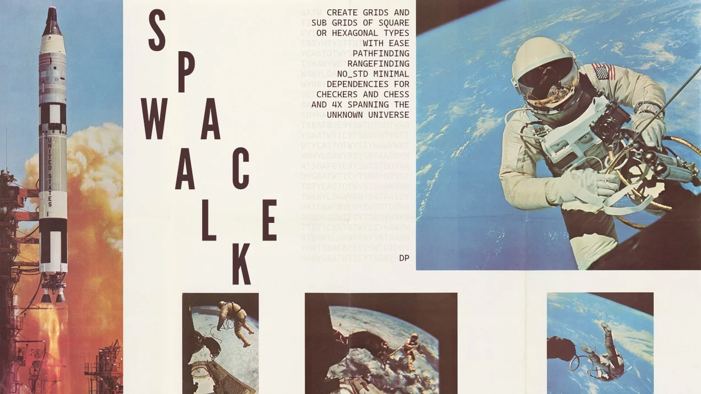

# spacewalk

## SPECIAL REPORT — A SMALL GRID LIBRARY ENTERS THE SPACE RACE

There is a new instrument in the mission-control room for board games, tactics games, tile maps,
and other operations conducted on a lattice. `spacewalk` supplies the geometry: cells, directions,
distance, sight, regions, and routes. It does not carry pieces, terrain, players, or a game clock.
Those remain under the command of your application.

The crate is generic enough for square, hexagonal, and unusual boards, yet direct enough for the
ordinary case. It is `#![no_std]`, uses `alloc`, and keeps pathfinding in integer arithmetic so a
replay on one machine agrees with a replay on another.

```toml
[dependencies]
spacewalk = "0.1"
```

## THE FIRST LAUNCH: FROM COORDINATES TO A ROUTE

The usual mission begins with a square map and a unit that must cross it. The coordinate-first API
keeps dense indices in the machinery room while the application speaks in cells.

```rust
use spacewalk::{Adjacency, FullGrid, Grid, Movement, Sq};

let grid = FullGrid::square(8, 8, Adjacency::Four);
let mud = [Sq::new(3, 3), Sq::new(3, 4)];

let movement = Movement::cell_cost(&grid, |cell| {
    Some(if mud.contains(&cell) { 30 } else { 10 })
});

let route = grid
    .path_between(Sq::new(0, 0), Sq::new(7, 7), &movement)
    .expect("the route should be open");

assert_eq!(route.len(), 14);
assert_eq!(route.cells(&grid).count(), 15); // the start is included
```

`Grid::path_between` returns `None` if either coordinate is off the board or if no route exists.
The index-oriented `Grid::path` remains available when a hot loop or a side table already works in
`Idx` values.

## WHAT MISSION CONTROL RECEIVES

The public vocabulary is the `Grid` trait. Three board types speak it:

| Instrument | Assignment |
|---|---|
| `FullGrid<C>` | Stores any set of `C` cells, their directions, an index, and forward and reverse step tables. |
| `RectGrid` | Computes a rectangular square board arithmetically, without storing a cell or edge table. |
| `SubGrid<'a, B>` | Borrows a board and presents a selected region as a board of its own. |

All three answer the same questions. Code written against `Grid` can move from a full map to a
rectangle or a highlighted region without a change of course.

`FullGrid` is the general launch vehicle. It accepts any `Coord`, removes duplicate cells while
keeping the first occurrence, and preserves the caller’s cell order as the index order. It also
inverts its step table, so one can ask not only where a cell may go but which cells may enter it.

The built-in square and hex missions are:

- `FullGrid::square(w, h, Adjacency::Four)` — orthogonal movement and Manhattan distance.
- `FullGrid::square(w, h, Adjacency::Eight)` — orthogonal and diagonal movement with Chebyshev distance.
- `FullGrid::disc(radius, adjacency)` — an origin-centred circular selection of square cells.
- `FullGrid::hexagon(radius)` — an origin-centred axial hexagon.
- `FullGrid::hex_rect(w, h, offset)` — a rectangular hex field in a tile-map offset convention.

`FullGrid::filtered` creates a new, independent board and numbers its surviving cells again. Use
`Grid::subset` when the desired result is a temporary region that must still know its parent board.

## THE GRID’S FLIGHT INSTRUMENTS

For a coordinate-first mission, the common controls are:

| Control | Report |
|---|---|
| `at(c)` / `index_of(c)` | Convert a coordinate to an index; the first panics off-board, the second returns `Option`. |
| `step_from(c, dir)` | Take one geometric step and return the destination coordinate, or `None`. |
| `coord(i)` / `coords_of(indices)` | Convert indices back to coordinates for drawing, saving, or application state. |
| `neighbors(i)` / `in_neighbors(i)` | Inspect outgoing or incoming edges, with their directions. |
| `ray(i, dir)` | Slide through successive cells until the board or a hole ends the flight. |
| `run(i, dir, same)` | Collect the uninterrupted line through a cell in both directions. |
| `offset(i, delta)` | Make a coordinate hop that ignores intervening board cells: a knight or a jump. |
| `distance`, `within`, `ring` | Measure range in coordinates and return regions as `SubGrid`s. |
| `line`, `los`, `visible_from` | Draw lines and determine whether blockers interrupt sight. |
| `component`, `is_connected` | Survey passable islands and forward connectivity. |
| `subset` | Turn any selected indices into a borrowed board of their own. |
| `path`, `reachable`, `path_toward`, `reaching` | Search the directed movement graph. |

The coordinate-first counterparts are `within_cell`, `visible_from_cell`, `component_from`,
`path_between`, `reachable_from`, and `reaching_cell`. They return coordinates, `Path`s, or
`SubGrid`s as appropriate, and return `None` when the named origin or destination is off-board.

## COST OF THE FLIGHT: ENTERING A CELL

Movement costs belong to the cell being entered and to the direction of arrival. The graph is
therefore directed. A river may be cheap downstream and dear upstream; a conveyor may carry a
craft one way; a ledge may be descended but not climbed.

`None` means the step is forbidden. Costs are `u32` values, and the callback must be pure: A* may
ask about the same step more than once.

For terrain keyed by coordinates, use `Movement::cell_cost`. For currents, ledges, and other
directional rules, use `Movement::edge_cost`:

```rust
use spacewalk::{Adjacency, Dir8, FullGrid, Grid, Movement, Sq};

let grid = FullGrid::square(8, 8, Adjacency::Four);
let river = Sq::new(2, 2);

let movement = Movement::edge_cost(&grid, |_from, to, direction| {
    if to == Sq::new(4, 4) {
        None
    } else if to == river {
        Some(if direction == Dir8::S { 1 } else { 50 })
    } else {
        Some(10)
    }
});

assert_eq!(
    grid.path_between(Sq::new(2, 1), Sq::new(2, 3), &movement)
        .unwrap()
        .cost(),
    11
);
```

The constructors are as follows:

- `Movement::scan` examines every legal edge, discovers the cheapest step, and checks that costs
  cannot overflow a path total.
- `Movement::uniform` assigns one cost to every step without scanning the board.
- `Movement::new` accepts a caller-promised minimum and performs no validation; promising too high
  a minimum can make A* return a non-cheapest route.
- `Movement::try_scan` and `Movement::try_uniform` return `MovementError` instead of panicking when
  the cost ceiling is exceeded.

No simple path visits a cell twice, so the safe per-step ceiling is `Cost::MAX / max(1, cells - 1)`.
The search saturates totals rather than wrapping them, but a saturated total is not a meaningful
route cost; the checked constructors are the recommended launch procedure.

## A* AND DIJKSTRA ON A DIRECTED MAP

`Grid::path` uses A* with the board’s metric and the movement model’s cheapest step. With an honest
minimum step and an admissible metric, it returns a cheapest route. `Grid::reachable` is a forward,
budget-bounded Dijkstra search. `Grid::reaching` runs the reverse question: which cells can reach
this target, and at what cost?

`Grid::path_toward` returns the best route that can be completed within a budget, even when the
target itself is beyond reach. Ties are resolved deterministically by distance, cost, and index.

Paths contain indices because the search operates on dense board slots. `Path::steps` exposes them;
`Path::cells(&grid)` turns them into coordinates. The path and grid must be the same board. In debug
builds, the crate’s identity checks report a mismatch.

## RANGE, SIGHT, AND THE METRIC

`Metric::scanning` supplies only a distance function and makes range queries scan the board. This
is the proper choice for a non-translation-invariant or high-dimensional coordinate system.
`Metric::tabulated` additionally supplies a count and offset generator, allowing `within` and
`ring` to build a small neighbourhood instead of surveying the whole board. The grid checks the
count before allocating; an extravagant radius falls back to a board scan.

A metric must not overestimate the number of movement steps. For a `FullGrid`, each actual edge is
also checked: one direction may not span more than one metric unit. If a board contains genuine
multi-cell jumps or portals, an always-underestimating metric—often one that returns zero—keeps the
answer correct while making A* behave like Dijkstra.

Line of sight requires a metric with `lerp`. Built-in square and hex metrics provide one; an exotic
coordinate may honestly omit it, in which case `line` returns no samples and `los` has no blockers
to inspect. `visible_from` uses bounded raycasting and refuses radii above `MAX_SIGHT`, currently 64.
On sparse boards with
coordinates very far apart, line sampling scans the board rather than attempting work proportional
to the coordinate gap.

## A REGION IS A BOARD

`within`, `ring`, `component`, `visible_from`, and `subset` return `SubGrid`. It borrows the root
board, sorts and deduplicates its selected root cells, and gives the region its own local numbering.
Steps leaving the region are absent, so a path searched on the region cannot wander beyond it.

The root and region indices are both valid numbers, but they are not interchangeable. Use
`to_root` and `of_root` to cross the boundary. `root_indices` and its clearer alias
`indices_in_root` provide the region’s cells in root numbering for a root-owned `CellMap` or other
root table.

```rust
use spacewalk::{Adjacency, FullGrid, Grid, Movement, Sq};

let grid = FullGrid::square(16, 16, Adjacency::Eight);
let movement = Movement::uniform(&grid, 10);
let reach = grid
    .reachable_from(Sq::new(4, 4), 30, &movement)
    .unwrap();
let region = grid.subset(reach.iter().map(|&(cell, _)| grid.at(cell)));
let region_movement = Movement::uniform(&region, 10);

assert!(region.contains(Sq::new(4, 7)));
assert!(region
    .path_between(Sq::new(4, 4), Sq::new(4, 7), &region_movement)
    .is_some());
```

## THE CELL MAP: ONE VALUE PER CELL

`CellMap<T>` is the crate’s guarded `Vec<T>` for per-cell data. It is sized from a `Grid`, does not
hold the grid, and is indexed by `Idx` rather than by a hand-written cast.

`CellMap::new` fills a map with one cloned value; `CellMap::from_fn` computes values from
coordinates. `iter` and `iter_mut` expose indexed values, while `get` and `get_mut` provide checked
access. `as_slice`, `as_mut_slice`, `into_vec`, `fill`, `len`, and `is_empty` cover ordinary vector
interoperability.

A map is positional. A map made for one board is stale after `filtered` or when used with a
different board, even if the raw index is in range. Debug builds check the board identity; release
builds remove that check. Build a fresh map for a fresh board.

## SQUARES, HEXES, AND THE DRAWING DESK

`Sq` is an integer square coordinate with `x` increasing east and `y` increasing downward.
`Dir8` supplies eight compass-labelled directions, plus the orthogonal and diagonal subsets.
`Adjacency::Four` pairs with Manhattan distance; `Adjacency::Eight` pairs with Chebyshev distance.
`CornerRule` and `corner_gate` express strict, loose, or free diagonal corner-cutting as a game
rule layered on top of the board geometry.

`Hex` uses axial coordinates, and `Dir6` supplies its six directions. `Offset` converts between
axial hexes and the `(column, row)` conventions used by tile-map files. `HexLayout` and `SqLayout`
are presentation tools: they place cells on a screen, recover a cell beneath a pointer, and return
corners for drawing. The public layout boundary uses `f32`; its internal calculations use `f64`.
No floating-point value enters a cost, metric, or step table.

```rust
use spacewalk::{FullGrid, Grid, HexLayout, Offset, Pt};

let map = FullGrid::hex_rect(20, 12, Offset::OddR);
let layout = HexLayout::pointy(Pt::new(32.0, 32.0))
    .at(Pt::new(400.0, 300.0));

let hovered = map.index_of(layout.hex_at(Pt::new(430.0, 310.0)));
assert!(hovered.is_some());
assert_eq!(map.index_of(layout.hex_at(Pt::new(9000.0, 9000.0))), None);
```

## INDICES, IDENTITY, AND THE RECORD BOOK

`Idx` is a dense `u32` address issued by one board. It is stable for that board’s lifetime and
meaningless as a saved coordinate. Serialize coordinates, never indices.

In debug builds an index carries a board identity and foreign indices are rejected when they are
used. In release builds that identity is zero-sized and the check disappears. Equality, ordering,
and hashing use the numeric slot in both profiles, so the check is a development aid rather than a
runtime security barrier.

`FullGrid` and `Metric` are deliberately not serializable: the grid’s tables are derived and the
metric contains function pointers. Save the board definition—dimensions, radius, adjacency, or the
ordered cell list—and rebuild it. A `CellMap` serializes as a list in index order when `serde` is
enabled; save it beside the ordered cells that give those values their meaning.

## SAFETY CAPS AND FALLIBLE CONSTRUCTION

The crate refuses resource requests that could turn a bad map file into a machine-sized incident.

- `MAX_CELLS` is `2²⁴`, or 16,777,216 cells. `FullGrid` also bounds its cell-direction table.
- `MAX_SIGHT` is 64 because the current field-of-view algorithm is naive raycasting with cubic
  growth in the sight radius.
- `FullGrid::new` panics on a disagreeing metric or capacity request. The shape constructors
  `FullGrid::square`, `disc`, `hexagon`, `hex_rect`, and `RectGrid::new` also panic on invalid
  dimensions or radii.
- `FullGrid::try_new`, `try_square`, `try_disc`, `try_hexagon`, `try_hex_rect`, and
  `RectGrid::try_new` return `GridError` for those recoverable construction failures.

These limits bound work and memory derived from a board, not the application’s terrain or pieces.
They are especially important for maps loaded from outside the program.

## A BARE-METAL PROGRAM

The library is `#![no_std]` and requires `alloc`. Its one runtime dependency is `hashbrown`, used
for coordinate lookup without importing the standard library. The optional `serde` feature is off
by default and adds serialization derives to the plain-data types and `CellMap<T>` where `T` is
serializable.

The current package requires Rust 1.88 or later and uses edition 2024. The continuous-integration
configuration checks the host library with and without `serde`, the `thumbv7em-none-eabihf` target,
the debug and release profiles, rustfmt, Clippy, and rustdoc.

## TEST RANGE

The `tests/` directory contains public-API missions for square tactics, checkers, hex capture,
hex fields, three-dimensional chess, drawing and picking, field of view, directed threats,
directional terrain, admissible A*, determinism, save/load, range costs, highlighted regions,
identity checks, and robustness at hostile numeric limits.

The principal local launch sequence is:

```sh
cargo test --all-targets
cargo test --all-features --all-targets
cargo test --all-features --doc
cargo test --release --all-features --all-targets
cargo test --release --all-features --doc
cargo fmt --all --check
cargo clippy --all-features --all-targets
RUSTDOCFLAGS=-Dwarnings cargo doc --no-deps --all-features
```

For the bare-metal report, install the target and run:

```sh
cargo build --target thumbv7em-none-eabihf
cargo build --target thumbv7em-none-eabihf --features serde
```

## LICENSE

[MIT](LICENSE-MIT) or [Apache-2.0](LICENSE-APACHE)

*Banner image: “Astronaut Walks in Space,” credited to the U.S. Information Agency; [source via Artvee](https://artvee.com/dl/astronaut-walks-in-space).*
